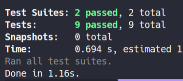

# Desafio 03 - Corrigindo o código 

## Sobre o desafio:

Nesse desafio, temos uma aplicação Node.js que está em processo de desenvolvimento mas que já possui os testes necessários para fazer toda a validação dos requisitos (você não deve mexer nos testes).

Essa aplicação realiza o CRUD (**C**reate, **R**ead, **U**pdate, **D**elete) de repositórios de projetos. Além disso, é possível dar likes em repositórios cadastrados, aumentando a quantidade de likes em 1 a cada vez que a rota é chamada.

A estrutura de um repositório ao ser criado é a seguinte:

```js
{
  id: uuid(),
  title,
  url,
  techs,
  likes: 0
}
```

Descrição de cada propriedade:

- **id** deve ser um uuid válido;
- **title** é o título do repositório (por exemplo "unform");
- **url** é a URL que aponta para o repositório (por exemplo "[https://github.com/unform/unform](https://github.com/unform/unform)");
- **techs** é um array onde cada elemento deve ser uma string com o nome de uma tecnologia relacionada ao repositório (por exemplo: ["react", "react-native", "form"]);
- **likes** é a quantidade de likes que o repositório recebeu (e que vai ser incrementada de 1 em 1 a cada chamada na rota de likes).

Note que a quantidade de likes deve sempre ser zero no momento de criação.

### Teste



## Rotas da aplicação

Com o template já clonado e o arquivo `index.js` aberto, você deve completar onde não possui código com o código para atingir os objetivos de cada teste.

**GET** `/repositories`

A rota deve retornar uma lista contendo todos os repositórios cadastrados.

**POST** `/repositories`

A rota deve receber `title`, `url` e `techs` pelo corpo da requisição e retornar um objeto com as informações do repositório criado e um status `201`.

**PUT** `/repositories/:id`

A rota deve receber `title`, `url` e `techs` pelo corpo da requisição e o `id` do repositório que deve ser atualizado pelo parâmetro da rota. Deve alterar apenas as informações recebidas pelo corpo da requisição e retornar esse repositório atualizado.

**DELETE** `/repositories/:id`

A rota deve receber, pelo parâmetro da rota, o `id` do repositório que deve ser excluído e retornar um status `204` após a exclusão.

**POST** `/repositories/:id/like`

A rota deve receber, pelo parâmetro da rota, o `id` do repositório que deve receber o like e retornar o repositório com a quantidade de likes atualizada.
